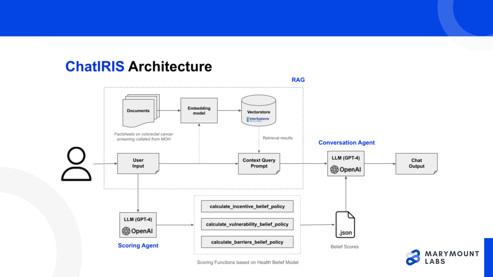

### Marymount Labs — _ChatIRIS Health Coach_

> Smart health coach to persuade Singaporeans to take preventive health measures<br/>
>
> - [💡 Idea](https://ideas.intersystems.com/ideas/DPI-I-560)
> - [💭 Community Article](https://community.intersystems.com/post/preventive-health-chatiris-integrating-intersystems-iris-enhanced-patient-engagement)
> - [📦 Exchange Package](https://openexchange.intersystems.com/package/iris-health-coach)
> - [✨ Presentation](https://youtu.be/nMGaW88ZUJ8) / [Preview](https://youtu.be/cHxjdNddOl4)
<br/>

<p align="center">
  
</p>

---

# Introduction
In Singapore, less than 1 in 4 go for annual vaccinations. Only a third of eligible adults are screened for common cancers. Convincing people to be vaccinated or screened for cancer will benefit from a personalised approach, but empathetic conversations are difficult to scale.

# Using LLMs in Dialogue Planning
One way of sustaining empathetic conversations to drive preventive health action could be via LLMs. For persuasive goal-oriented conversation, the LLM has to adequately address the person’s concerns and needs.

Early efforts in goal-based dialogue planning are exploring multi-step planning and using Bayesian techniques to adaptively craft goal-driven utterances. However, there are few efforts that explicitly attempt to address the person’s replies at a psychological or empathetic level.

# IRIS Health Coach
We introduce the ChatIRIS Health Coach, a [GPT-4]((https://platform.openai.com/docs/models/gpt-4-turbo-and-gpt-4)) based agent that leverages the Health Belief Model (Hochbaum, Rosenstock, & Kegels, 1952) as a psychological framework to craft empathetic replies.

- Framework: [IRIS Interoperability Framework with Embedded Python](https://github.com/grongierisc/interoperability-embedded-python)
- Vector, RAG: [IRIS Vector Search](https://www.intersystems.com/sg/data-platform/generative-ai/)
- Model: [OpenAI `gpt-4o`](https://platform.openai.com/docs/models/gpt-4-turbo-and-gpt-4)

<p align="center">
  
</p>

The Health Belief Model suggests that individual health behaviours are shaped by personal perceptions of vulnerabilities to disease risk, alongside the perceived incentives and barriers to taking action.

Our approach disaggregates these concepts into 14 distinct belief scores, allowing us to dynamically monitor them over the course of the conversation. You can view the belief scores in [`tools/belief_tools.json`](src/python/rag/tools/belief_tools.json).

In the context of preventive health actions (e.g. cancer screening, vaccinations), we find that the agent is fairly successful at picking up a person’s beliefs around health actions (e.g. perceived vulnerabilities and barriers). We demonstrate the agent’s capabilities in the specific instance of a colorectal cancer screening campaign.

# 🛠️ Installation and Set Up
## 1. Clone repository
  ```bash
  git clone git@github.com:Marymount-Labs/iris-coach.git
  cd iris-coach
  ```
> [!IMPORTANT]
> Duplicate `.env.example` to create `.env` file
> ```bash
> cp .env.example .env
> ```

## 2. Run application
  ```bash
  docker compose up
  ```
> [!NOTE]
> Everything is local, nothing is sent to the cloud, so be patient, it can take a few minutes to start.

# Usage

| First Header  | Second Header |
| ------------- | ------------- |
| Frontend  | [localhost:8051](http://localhost:8051)  |
| Backend  | [localhost:53795](http://localhost:53795/csp/irisapp/EnsPortal.ProductionConfig.zen?$NAMESPACE=IRISAPP&$NAMESPACE=IRISAPP)  |


## Frontend
The first page is the chat interface where you can interact with the ChatIRIS Health Coach. On the sidebar, you may select from a list of FAQs.

<details>
  <summary>🪟 Preview Pages</summary>
  <br/>

  ### Chat interface
  

  ### Admin interface
  
</details>

## Backend

Vector Search in RAG pipeline:
1) [IrisVectorOperation.init_data](https://github.com/Marymount-Labs/iris-coach/blob/6d19ddd37957e035a921170dac02cfbed63cf1c3/src/python/rag/business_operation.py#L151): IRIS Vector store is initialised with the [initial knowledge base](src/python/rag/data/factsheet.pdf)
2) [ChatProcess.ask](https://github.com/Marymount-Labs/iris-coach/blob/main/src/python/rag/business_process.py#L56-L62): Invoke [VectorSearchRequest](https://github.com/Marymount-Labs/iris-coach/blob/6d19ddd37957e035a921170dac02cfbed63cf1c3/src/python/rag/business_process.py#L56) to retrieve the relevant information from IRIS

Scoring Agent:
1) [ScoreOperation.on_init](https://github.com/Marymount-Labs/iris-coach/blob/6d19ddd37957e035a921170dac02cfbed63cf1c3/src/python/rag/business_operation.py#L311): Initialise the scoring agent with initial prompt and belief map
2) [ScoreOperation.ask](https://github.com/Marymount-Labs/iris-coach/blob/6d19ddd37957e035a921170dac02cfbed63cf1c3/src/python/rag/business_operation.py#L375-L391): Calculate user's belief scores based on verbal cues
2) [ScoreOperation.create_belief_prompt](https://github.com/Marymount-Labs/iris-coach/blob/6d19ddd37957e035a921170dac02cfbed63cf1c3/src/python/rag/business_operation.py#L342): Creates the optimal belief prompt using the user's belief scores

Finally, using the chat history, the belief scores from the scoring agent, and the retrieved context from the RAG pipeline, the conversation model will be able to generate an informed and persuasive response for the user

_Find out more about it in [Preventive Health with ChatIRIS: Integrating InterSystems IRIS for Enhanced Patient Engagement](https://community.intersystems.com/post/preventive-health-chatiris-integrating-intersystems-iris-enhanced-patient-engagement)_


# Contributors ✨
<table>
  <tr>
    <td align="center"><a href="https://github.com/zacchaeuschok" target="_blank"><br /><sub><b>Zacchaeus Chok</b></sub></a><br />
    <td align="center"><a href="https://github.com/crystalcheong"  target="_blank"><br /><sub><b>Crystal Cheong</b></sub></a><br /></td>
  </tr>
</table>

# References
Gao, Y. (2023, December 18). Retrieval-Augmented Generation for Large Language Models: A survey. arXiv.org. https://arxiv.org/abs/2312.10997

Hu, Z., Feng, Y., Deng, Y., Li, Z., Ng, S., Luu, A. T., & Hooi, B. (2023). Enhancing large language model induced Task-Oriented dialogue systems through Look-Forward motivated goals. arXiv (Cornell University). https://doi.org/10.48550/arxiv.2309.08949

Jang, Y., Lee, J., & Kim, K.-E. (2020). Bayes-Adaptive Monte-Carlo Planning and Learning for Goal-Oriented Dialogues. Proceedings of the AAAI Conference on Artificial Intelligence, 34(05), 7994-8001. https://doi.org/10.1609/aaai.v34i05.6308

Lau, J., Lim, T.-Z., Jianlin Wong, G., & Tan, K.-K. (2020). The health belief model and colorectal cancer screening in the general population: A systematic review. Preventive Medicine Reports, 20, 101223. https://doi.org/10.1016/j.pmedr.2020.101223

Reddy, S. (2023). Evaluating large language models for use in healthcare: A framework for translational value assessment. Informatics in Medicine Unlocked, 41, 101304. https://doi.org/10.1016/j.imu.2023.101304

Rosenstock, I. M. (1974). The Health Belief Model and Preventive Health Behavior. Health Education Monographs, 2(4), 354–386. http://www.jstor.org/stable/45240623

X, Y., Chen, M., & Yu, Z. (2023). Prompt-Based Monte-Carlo Tree Search for Goal-oriented Dialogue Policy Planning. ACL Anthology. https://doi.org/10.18653/v1/2023.emnlp-main.439

Grongier. (n.d.). Interoperability embedded Python. GitHub. https://github.com/grongierisc/interoperability-embedded-python
